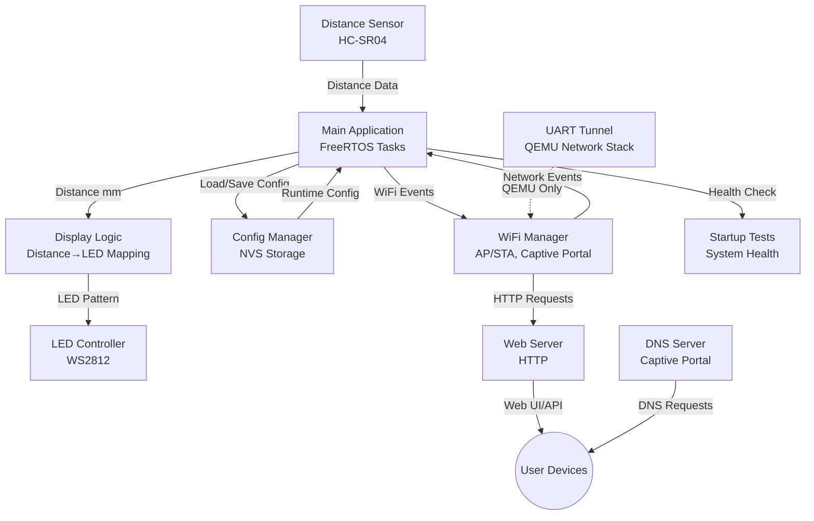

# ESP32 Project Template: Architecture Overview (Example)

> **📝 Note:** This is an example architecture document from the original distance sensor project.
> It demonstrates how to document system architecture and component relationships.
> **Replace this with your own project's architecture.**

This document provides an example of architectural documentation for an ESP32 project.

## Example System Overview

The example system described here was an IoT device based on the ESP32 WROOM-32F microcontroller. It measured distance using an HC-SR04 ultrasonic sensor and visualized results on a WS2812 LED strip. The device provided WiFi connectivity (AP/STA modes), a web interface with captive portal, and persistent configuration management. The project included full QEMU emulator support for hardware-free development and testing.

## Architecture Diagram



## Key Components

### Core Hardware Components

- **Distance Sensor Component** (`components/distance_sensor/`): Interfaces with HC-SR04 ultrasonic sensor, provides distance readings via FreeRTOS queue-based architecture.
- **LED Controller Component** (`components/led_controller/`): Drives WS2812 addressable LED strip with precise timing control.
- **Display Logic Component** (`components/display_logic/`): Maps distance measurements to LED visualization patterns with configurable ranges.

### Network & Connectivity

- **WiFi Manager** (`components/web_server/wifi_manager.c`): Manages AP/STA modes, captive portal, and WiFi event handling.
- **Web Server** (`components/web_server/`): HTTP server hosting configuration UI and API endpoints.
- **DNS Server** (`components/web_server/dns_server.c`): DNS redirection for captive portal functionality.
- **UART Network Tunnel** (`components/netif_uart_tunnel/`): QEMU-specific component providing full TCP/IP stack via UART1.

### Configuration & System Management

- **Configuration Manager** (`components/config_manager/`): NVS-based persistent storage for system settings (distance ranges, LED config, WiFi credentials).
- **Startup Tests** (`components/startup_tests/`): System health checks and component validation on boot.
- **Main Application** (`main/main.c`): Coordinates FreeRTOS tasks, event handling, and inter-component communication.

### Emulator Support

- **Simulator Components**: Hardware abstraction layer with identical APIs for QEMU execution:
  - `distance_sensor_sim.c`: Animated distance sensor (5cm→60cm sweep)
  - `led_controller_sim.c`: Terminal-based LED visualization with emoji blocks
  - `netif_uart_tunnel_sim.c`: UART-based IP tunnel for network connectivity

## Data Flow

### Real-Time Sensor Processing

1. **Sensor Measurement**: HC-SR04 readings acquired in dedicated FreeRTOS task, published to queue
2. **Distance Processing**: Display logic subscribes to sensor queue, calculates LED position
3. **LED Visualization**: LED controller renders distance as color-coded position on strip (real-time, <100ms latency)

### Configuration Management

1. **Persistent Storage**: Configuration manager handles NVS operations for system settings
2. **Runtime Configuration**: Main application loads config on boot, applies to all components
3. **Configuration Updates**: Web interface allows runtime changes (saved to NVS for persistence)

### Network & User Interface

1. **WiFi Connectivity**: Device operates in AP mode (default) or STA mode (configured)
2. **Captive Portal**: DNS server redirects all requests to device IP for easy initial setup
3. **Web Interface**: HTTP server hosts configuration UI (distance ranges, LED settings, WiFi setup)
4. **API Endpoints**: RESTful API for configuration GET operations (POST planned)

### Emulator-Specific Data Flow

1. **QEMU Network Tunnel**: UART1-based IP tunnel bridges ESP32 lwIP stack to host TUN device
2. **Frame Encapsulation**: Ethernet frames transmitted over UART with length-prefixed framing
3. **HTTP Proxy**: Host-side proxy forwards localhost:8080 → ESP32:80 for browser access

## Design Principles

- **Component-based architecture**: Each hardware and software function is modularized with clean interfaces.
- **Hardware abstraction**: Simulator components provide identical APIs for QEMU emulation.
- **Memory optimization**: Designed for 4MB flash ESP32 modules, with careful heap/stack usage (41% flash free).
- **Real-time operation**: FreeRTOS queue-based architecture for concurrent, responsive sensor processing.
- **Configuration persistence**: NVS-based storage with validation, defaults, and factory reset.
- **Development-friendly**: Full QEMU emulator support enables hardware-free development and CI/CD.
- **Traceability**: Requirements and design documented and linked in code (OpenFastTrack methodology).
- **Testability**: Component isolation enables unit testing and system health checks.

## Emulator Support Architecture

The project includes comprehensive QEMU emulator support, enabling full development and testing without physical hardware.

### Hardware Abstraction Strategy

- **Identical APIs**: Hardware and simulator components share the same header files
- **CMake Selection**: Build system automatically selects implementation based on `CONFIG_TARGET_EMULATOR`
- **No Conditional Compilation**: Clean code without `#ifdef` clutter in application logic

### Simulator Components

| Component | Hardware | Simulator | Key Differences |
|-----------|----------|-----------|----------------|
| **Distance Sensor** | `distance_sensor.c` | `distance_sensor_sim.c` | Animated 5cm→60cm sweep vs. real HC-SR04 |
| **LED Controller** | `led_controller.c` | `led_controller_sim.c` | Terminal emoji visualization vs. WS2812 hardware |
| **Network Stack** | ESP32 WiFi driver | `netif_uart_tunnel_sim.c` | UART-based IP tunnel vs. WiFi radio |

### QEMU Network Architecture

```text
┌─────────────────────────────────────────────────────────┐
│  Host (Linux)                                           │
│  ┌──────────┐    ┌──────────┐    ┌───────────────┐     │
│  │ Browser  │───▶│ tun0     │◀──▶│ TUN Bridge    │     │
│  │ :8080    │    │ 192.168. │    │ (Python)      │     │
│  └──────────┘    │ 100.1/24 │    └───────────────┘     │
│                  └──────────┘            │ TCP:5556    │
└──────────────────────────────────────────┼─────────────┘
                                           │
┌──────────────────────────────────────────┼─────────────┐
│  ESP32 QEMU                              ▼             │
│  ┌──────────┐    ┌──────────┐    ┌──────────┐         │
│  │ Web      │◀──▶│ lwIP     │◀──▶│ UART1    │         │
│  │ Server   │    │ Stack    │    │ Driver   │         │
│  │ :80      │    │ 192.168. │    └──────────┘         │
│  └──────────┘    │ 100.2/24 │                         │
│                  └──────────┘                         │
└───────────────────────────────────────────────────────┘
```

### Benefits

- ✅ **Fast Iteration**: No flashing hardware, instant rebuild-test cycles
- ✅ **CI/CD Ready**: Automated testing in GitHub Actions without hardware
- ✅ **Visual Feedback**: Terminal-based LED visualization for development
- ✅ **Full Network Stack**: Real TCP/IP connectivity via UART tunnel
- ✅ **Cross-Platform**: Develop on any system with QEMU support

For detailed information, see [Emulator Support Documentation](../emulator-support.md).

---

## Last updated

2025-10
