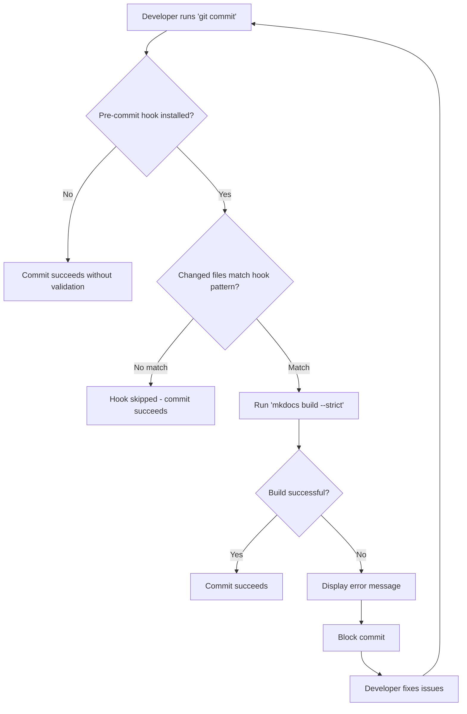

# Pre-commit Hooks

This project uses [pre-commit](https://pre-commit.com/) hooks to ensure code quality and documentation integrity before commits reach the repository.

## Overview

Pre-commit hooks run automatically on `git commit` and validate changes before they are committed. This ensures:

- Documentation is always valid and buildable
- Markdown syntax follows consistent style guidelines
- Links and references are correct
- Code quality standards are met
- Both human developers and AI agents (like GitHub Copilot) follow the same quality gates

## Philosophy: Quality as a Process, Not a Gate

Pre-commit hooks are **automation assistants**, not quality gatekeepers. They:

- **Catch trivial errors** so humans can focus on design and logic
- **Enforce consistency** automatically (formatting, style)
- **Provide fast feedback** during development, not just at "the gate"

**Quality should be everywhere:**

- Write tests alongside code
- Review design before implementation
- Use IDE linters while editing (not just at commit time)
- Think about maintainability from the start

Pre-commit hooks are the *last automated safety check*, not the *first time* you think about quality.

## Current Hooks

### Markdown Linting

**Hook ID**: `markdownlint`

Validates Markdown syntax and style consistency across all documentation files.

**Configuration** (`.pre-commit-config.yaml`):

```yaml
- id: markdownlint
  name: Markdown lint
  entry: markdownlint --fix
  language: system
  types: [markdown]
  files: ^(docs/.*\.md|.*\.md)$
```

**What it checks:**

- Consistent heading styles and hierarchy
- Blank lines before lists and code blocks
- Trailing whitespace and multiple blank lines
- Proper code fence formatting
- Link reference definitions
- Consistent list marker styles

**When it runs:**

- On any `.md` file in the repository
- Auto-fixes issues when possible (e.g., adds missing blank lines)
- Runs before MkDocs validation

**Configuration** (`.markdownlint.json`):

```json
{
  "default": true,
  "MD013": false,
  "MD033": false,
  "MD041": false,
  "MD046": {
    "style": "fenced"
  }
}
```

**Key rules:**

- `MD013: false` - No line length limit (avoids breaking URLs)
- `MD033: false` - Allow inline HTML (useful for tables and complex layouts)
- `MD041: false` - Don't require H1 as first line
- `MD046: fenced` - Enforce fenced code blocks (\`\`\`) instead of indented

**Output example:**

```text
Markdown lint........................................................Failed
- hook id: markdownlint
- files were modified by this hook

docs/planning/Features-intended.md:38:1 MD032/blanks-around-lists 
Lists should be surrounded by blank lines [Context: "**What it checks**:"]

Fixed automatically - please review and stage changes
```

### MkDocs Documentation Validation

**Hook ID**: `mkdocs-build`

Validates all documentation using MkDocs strict mode before allowing commits.

**Configuration** (`.pre-commit-config.yaml`):

```yaml
- id: mkdocs-build
  name: MkDocs build (strict)
  entry: mkdocs build --strict
  language: system
  files: ^(docs/.*|mkdocs\.yml)$
```

**What it checks:**

- Broken links between documentation files
- Missing documentation files referenced in navigation
- Invalid Markdown syntax
- MkDocs configuration errors
- Missing required metadata

**When it runs:**

- Only when files in `docs/` directory change
- Only when `mkdocs.yml` configuration changes
- Skipped for code-only commits (performance optimization)

**Output**:

```text
MkDocs build (strict)....................................................Failed
- hook id: mkdocs-build
- duration: 1.01s
- exit code: 1

INFO    -  Cleaning site directory
INFO    -  Building documentation to directory: /workspaces/esp32-distance/site
WARNING -  Doc file 'architecture/README.md' contains a link 'nonexistent-file.md', 
but the target 'architecture/nonexistent-file.md' is not found among documentation f
iles.                                                                               

Aborted with 1 warnings in strict mode!
```

## Installation

### Automatic (Devcontainer)

Pre-commit and related tools are automatically installed when the devcontainer builds and starts:

1. **During container build** (`.devcontainer/Dockerfile`):
   - Installs Node.js and npm
   - Installs `markdownlint-cli` globally via npm
   - Installs MkDocs and related tools in `/opt/venv`

2. **On container start** (`.devcontainer/post-start.sh`):
   - Creates a dedicated virtualenv at `~/.venv-devtools`
   - Installs pre-commit into the virtualenv
   - Runs `pre-commit install --install-hooks` to set up git hooks

No manual action required - just start coding!

### Manual Installation

If not using the devcontainer or if hooks are not installed:

```bash
# Install pre-commit (if not already installed)
python3 -m pip install --user pre-commit

# Install hooks for this repository
cd /workspaces/esp32-distance
pre-commit install --install-hooks
```

## Usage

### Normal Workflow

Pre-commit hooks run automatically on `git commit`:

```bash
# Make changes to documentation
vim docs/architecture/README.md

# Stage and commit
git add docs/architecture/README.md
git commit -m "docs: Update architecture overview"

# Hook runs automatically and validates documentation
# If validation passes, commit succeeds
# If validation fails, commit is blocked with error message
```

### Running Hooks Manually

Test hooks without committing:

```bash
# Run all hooks on staged files
pre-commit run

# Run all hooks on all files
pre-commit run --all-files

# Run specific hook
pre-commit run mkdocs-build
pre-commit run markdownlint

# Skip hooks for a commit (use sparingly!)
git commit --no-verify
```

### Updating Hooks

When `.pre-commit-config.yaml` changes, pre-commit requires it to be staged:

```bash
# Pre-commit will show this error if config is modified but not staged:
[ERROR] Your pre-commit configuration is unstaged.
`git add .pre-commit-config.yaml` to fix this.

# Solution: stage the config file
git add .pre-commit-config.yaml
git commit -m "chore: Update pre-commit hooks"
```

## Troubleshooting

### Hook Not Running

If pre-commit hooks don't run automatically:

1. Check if hooks are installed:

   ```bash
   ls -la .git/hooks/pre-commit
   ```

2. Reinstall hooks:

   ```bash
   ~/.venv-devtools/bin/pre-commit install --install-hooks
   ```

3. Verify pre-commit is in PATH:

   ```bash
   which pre-commit
   # Should show: /home/esp/.venv-devtools/bin/pre-commit
   ```

### Markdownlint Not Found

The devcontainer has markdownlint-cli pre-installed globally via npm. If you see "markdownlint: command not found":

1. Check if markdownlint is installed:

   ```bash
   which markdownlint
   # Should show: /usr/local/bin/markdownlint or similar
   ```

2. Verify npm global packages:

   ```bash
   npm list -g --depth=0 | grep markdownlint
   ```

3. Reinstall if needed:

   ```bash
   sudo npm install -g markdownlint-cli
   ```

### MkDocs Not Found

The devcontainer has MkDocs pre-installed at `/opt/venv/bin/mkdocs`. If you see "mkdocs not found":

1. Check if mkdocs is in PATH:

   ```bash
   which mkdocs
   # Should show: /opt/venv/bin/mkdocs
   ```

2. Verify the venv is in PATH:

   ```bash
   echo $PATH | grep /opt/venv
   ```

3. Source the profile:

   ```bash
   source /etc/profile.d/venv-mkdocs.sh
   ```

### Skipping Hooks (Not Recommended)

In rare cases where you need to commit without running hooks:

```bash
# Skip all hooks (use with caution!)
git commit --no-verify

# Or skip specific hooks with environment variable
SKIP=mkdocs-build git commit -m "WIP: Draft documentation"
SKIP=markdownlint,mkdocs-build git commit -m "WIP: Draft with formatting issues"
```

**Warning**: Skipping hooks can introduce broken documentation into the repository. Only use this for work-in-progress commits on feature branches.

## Future Enhancements

### Planned Hooks

**Requirements Validation** (Coming Soon):

- Validate OpenFastTrack requirement format
- Check requirement ID uniqueness
- Verify bidirectional traceability links
- Ensure all requirements have design coverage

**Design Document Validation** (Coming Soon):

- Validate design document structure
- Check design-to-requirement traceability
- Verify design-to-implementation links
- Ensure code references are valid

**Code Quality** (Planned):

- C code formatting with `clang-format`
- Static analysis with `cppcheck`
- ESP-IDF specific linting
- Comment and documentation completeness

### Configuration Example (Future)

```yaml
repos:
  - repo: local
    hooks:
      # Documentation validation (current)
      - id: mkdocs-build
        name: MkDocs build (strict)
        entry: mkdocs build --strict
        language: system
        files: ^(docs/.*|mkdocs\.yml)$
        
      # Requirements validation (planned)
      - id: oft-requirements
        name: OpenFastTrack requirements validation
        entry: openfasttrace trace
        language: system
        files: ^docs/requirements/.*\.md$
        
      # Design validation (planned)
      - id: design-traceability
        name: Design traceability check
        entry: python tools/validate_design.py
        language: system
        files: ^docs/design/.*\.md$
        
      # Code formatting (planned)
      - id: clang-format
        name: Format C code
        entry: clang-format -i
        language: system
        files: \.(c|h)$
```

## Benefits

### Quality Assurance

- **Prevents broken documentation** from reaching the repository
- **Catches errors early** before they're committed
- **Enforces standards** automatically without code review overhead
- **Documentation stays in sync** with codebase changes

### Developer Experience

- **Fast feedback** - errors caught immediately on commit
- **Clear error messages** - shows exactly what's wrong and where
- **Smart filtering** - only runs when relevant files change
- **No manual steps** - auto-installs and auto-runs

### AI Coding Agent Compatibility

- **GitHub Copilot coding agents** must pass the same quality gates
- **Prevents AI from committing broken docs** or invalid links
- **Forces iterative fixes** until documentation is valid
- **Maintains quality** regardless of who (or what) is committing

## Technical Details

### File Structure

```text
.
├── .pre-commit-config.yaml        # Hook configuration
├── .git/hooks/pre-commit          # Installed hook script (auto-generated)
├── .devcontainer/
│   ├── post-start.sh             # Auto-install pre-commit on startup
│   └── Dockerfile                 # MkDocs pre-installed at build time
└── ~/.venv-devtools/              # Dedicated virtualenv for pre-commit
    └── bin/pre-commit
```

### Dependencies

- **Python 3**: Required for pre-commit framework
- **Node.js & npm**: Required for markdownlint-cli (via Dockerfile)
- **markdownlint-cli**: Pre-installed globally via npm (via Dockerfile)
- **MkDocs**: Pre-installed in `/opt/venv/` (via Dockerfile)
- **Pre-commit**: Installed in `~/.venv-devtools/` (via post-start.sh)

### Hook Execution Flow



## References

- [Pre-commit framework documentation](https://pre-commit.com/)
- [MkDocs documentation](https://www.mkdocs.org/)
- [Git hooks documentation](https://git-scm.com/book/en/v2/Customizing-Git-Git-Hooks)
- [OpenFastTrack project](https://github.com/itsallcode/openfasttrace) (for future requirements validation)

---

Last updated: October 2025
