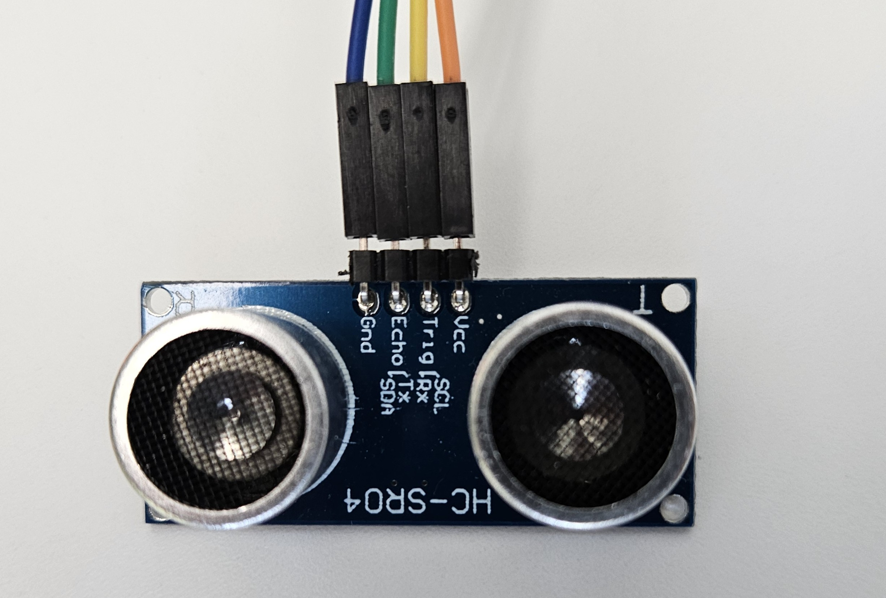

# Hardware Setup

This guide explains the hardware required for the ESP32 Distance Sensor Workshop and how to wire up the components.


## Required hardware

### ESP32 WROOM-32F development board
> **Note:** The board shown in the picture is an ESP32 Relay X2, but any ESP32 development board can be used for this workshop.

The ESP32 Relay X2 board features two onboard relays and supports a wide input voltage range from 5V to 60V, making it suitable for 12V, 24V, or 48V systems such as solar power batteries. However, it does **not** include a built-in USB serial connector, so you will need an external USB-to-serial adapter for programming and debugging. If you use a different ESP32 development board with onboard USB, the external adapter is not required.


### USB serial adapter
Here we see a CH340 USB-A to TTL-Serial adapter. Many ESP32 development boards already include a built-in USB-to-serial adapter, so this external adapter is not required if your board has onboard USB connectivity. Use the external adapter only if your ESP32 board lacks a native USB port for programming.,


### HC-SR04 ultrasonic distance sensor
The HC-SR04 ultrasonic distance sensor works by emitting an ultrasonic pulse from its trigger pin and then waiting for the echo signal to return. The sensor itself does not calculate distance; it simply provides a short trigger pulse input and then outputs a pulse on the echo pin whose duration corresponds to the time taken for the sound to travel to an object and back. The ESP32 microcontroller measures this echo pulse duration using a hardware timer and then calculates the distance based on the speed of sound. This approach enables accurate, non-contact distance measurement for robotics, automation, and IoT applications.



### WS2812 addressable LED strip (40 LEDs recommended)

The WS2812 is an addressable RGB LED strip, often called "NeoPixels," where each LED can be individually controlled for color and brightness using a single data line. For this workshop, a strip with 40 LEDs is recommended, providing a clear and colorful visual display of measured distances.


## Wiring overview
- Connect the HC-SR04 trigger pin to the **GPIO13 PIN** and the echo pin to **GPIO12 pin** on the ESP32. 
- Connect the HC-SR04 power to **the 5V pin** and ground to **any GND pin** of the ESP32 board. For details, see [requirements](../requirements/distance-sensor-requirements.md).
- Connect the WS2812 data line to the ESP32 **GPIO12 pin** (see also [requirements](../requirements/led-controller-requirements.md)).
- Connect the WS2812 ground to a **GND pin**
- Connect the WS2812 **5V Vcc** to ... well ... here's the thing the Relay X2 has no additional 5V pin available, but wait, there is a **3,3 V pin** and it works just fine.
- Connect the ESP32 module to GND and 5V of the USP Serial Adapter and **crossconnect** the two **TX x RX** lines
```
    +-------------------+         +-------------------------+
    |   USB Serial      |         |      ESP32 Board        |
    |   Adapter (CH340) |         |    (ESP32 WROOM-32F)    |
    +-------------------+         +-------------------------+
    |                   |         |                         |
    |   5V   -----------+---------+--- 5V                   |
    |   GND  -----------+---------+--- GND                  |
    |                   |         |                         |
    |   RX   -----------+--\   /--+--- RX (GPIO3/U0RXD)     |
    |                   |   \ /   |                         |
    |                   |   / \   |                         |
    |   TX   -----------+--/   \--+--- TX (GPIO1/U0TXD)     |
    |                   |         |                         |
    +-------------------+         +-------------------------+
```
**Note:** TX on the adapter connects to RX on the ESP32, and RX on the adapter connects to TX on the ESP32 (crossed lines).

> **Pro Tip:** Double-check your wiring before plugging the USB Serial Adapter into your PC or Laptop, sounds trivial but...... better save than sorry
